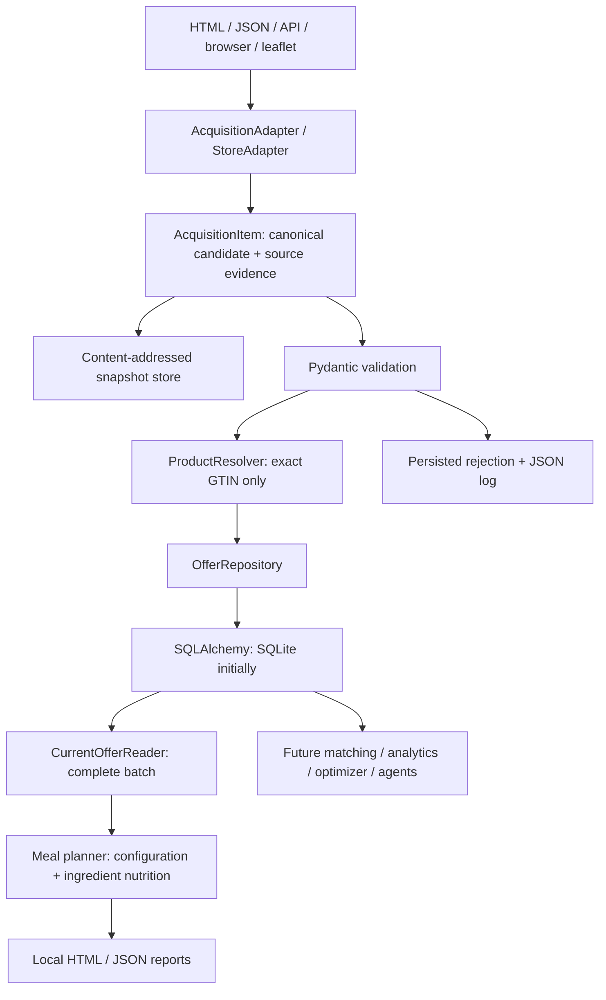

# Architecture

## Boundaries

`models/` contains strict, frozen, extra-field-forbidden business schemas and lexical normalization.
`stores/` contains acquisition, parsing, and registration. `pipeline/` saves evidence, validates,
resolves identity through a protocol, and persists through a repository protocol. `persistence/`
implements SQLAlchemy and file snapshots. `cli/` composes the services. No retailer branching exists
outside adapters. `meals/` consumes canonical offers through a read protocol and uses curated
ingredient data and fixed recipes; it is independent of acquisition and exact identity matching.
General analytics and optimization remain deferred. See [meal workflow](meals.md).

Adapters use the injected `httpx.AsyncClient`; browser dependencies are optional. HTML parsing is
included for the Kupi source. Acquisition
is async and streamed. SQLite transactions are synchronous and short (one accepted/rejected item).
This is suitable for a single daily local job, but SQL calls block the loop briefly. A future async
repository can replace this implementation when measured throughput or concurrency requires it.

## Domain

| Concept | Responsibility |
| --- | --- |
| Product | Cross-store identity; UUID resolved from validated GTIN initially |
| StoreProduct | Retailer identity `(store_id, sku)` and descriptive product facts |
| Quantity | Positive Decimal amount and enum: piece, package, kg, g, l, ml, serving |
| Offer | StoreProduct + opaque stable offer key + location/channel scope + selling terms |
| Promotion | Canonical type, loyalty requirement, minimum purchase, conditions, claimed discount |
| PriceObservation | Offer captured at an aware timestamp, linked to source snapshot |
| SourceEvidence | Raw bytes, URL, media type, fetch time, record locator, source-only metadata |

No cross-store identity is required to ingest an offer. Missing GTIN leaves the SKU unmatched.
Exact GTIN resolves identity but not semantic comparability or an authoritative catalog name.
Canonical catalog descriptions use first-seen facts for now; store descriptions remain separately
available. GTINs are validated and padded to 14 digits, preserving leading zeros.

Acquisition source identity is separate from the selling retailer. `AcquisitionAdapter.source_id`
identifies the run; `StoreProduct.store_id` identifies the seller. `StoreAdapter` is the convenient
single-retailer specialization. Aggregators such as Kupi implement the common base and supply an
identity-boundary validator. Acquisition-derived product/group IDs stay in their own SKU namespace;
they do not establish cross-store identity. See [Kupi mapping](kupi.md) for the first aggregator.

An offer is identified by `(store_id, sku, offer_key, scope)`. Standard/loyalty/coupon offers can
coexist. The adapter assigns opaque keys; downstream components interpret typed selling terms.
`scope` must represent a real location/channel limitation; it is not a claim of universal coverage.

`current_price` is for `price_basis`, not necessarily one product. Product `quantity` describes the
total contents of one sale item (e.g. 6 x 500 ml = 3000 ml); price basis could be 1 package or 1 kg.
Variable-weight goods require a mass price basis. Derived unit prices normalize g to kg and ml to l;
unknown contents remain priced per piece/package. Conditional unit prices retain promotion conditions;
an optimizer must check minimum purchase, loyalty and other conditions before using them.
`price_qualifier` distinguishes an exact quote from a starting/lower-bound quote (`from`); derived
unit prices retain the same qualifier. Lower bounds do not produce a calculated discount percentage.
Coffee doses/servings are distinct from physical pieces. Packaging alone does not establish weight;
adapters must preserve an explicit mass basis when actual pack contents are unknown.
Promotion percentages specify their comparison reference. `unspecified` means a preserved source
claim, not calculated regular-price savings. `advertised` can represent an advertised promotion
without a known baseline. `price_cut` still requires a lower current price and positive regular price.

Money uses Decimal strings at ingestion and four decimal places; floats, negatives, nonfinite values,
and excess precision are rejected. SQL stores ten-thousandths in signed 64-bit integers, so SQLite
never converts prices through floating point. Product quantities allow six decimal places.
Currency currently supports CZK and EUR. Validity uses inclusive local calendar dates; observation
times are timezone-aware and stored in UTC. No midnight or timezone is guessed by the pipeline.

## Database schema

| Table | Key / purpose |
| --- | --- |
| products | UUID primary key, unique optional GTIN, canonical descriptive JSON |
| store_products | Deterministic UUID, unique `(store_id, sku)`, nullable product FK, latest descriptive JSON |
| offers | Deterministic UUID, SKU FK, unique `(store_product_id, offer_key, scope)` |
| price_observations | UUID, offer FK, state fingerprint, exact price columns, complete canonical JSON, first/last seen |
| source_snapshots | UUID, run FK, hash/path metadata, URL, locator, fetch timestamp, raw metadata JSON |
| scrape_runs | UUID, acquisition source, started/finished timestamps, status, fetched/accepted/rejected/changed/errors counters |
| scrape_items | UUID, run FK, snapshot FK, nullable observation FK, status and diagnostic details |

Raw bytes are content-addressed SHA-256 files outside SQL. Each fetched item retains a separate
provenance row, even if the content or business state is unchanged. Backups must include both stores.

The Python/JSON run field is `source_id`. Its SQL column retains the original name `store_id` for
compatibility with existing SQLite databases; SQLAlchemy maps that column explicitly. Retailer
identity in `store_products.store_id` is unchanged. Old promotion JSON without `discount_reference`
continues to mean `regular_price` through the schema default. Re-ingestion materializes that field
and may record one schema-related state change; no history is rewritten.
Likewise, old offers default to `price_qualifier = exact`; re-ingestion materializes that field and
may add one state. These additions live in canonical JSON and require no new SQL columns.

Only consecutive identical canonical offer states collapse into an existing observation; `last_seen`
advances and a scrape item records the new evidence. A -> B -> A produces three historical states.
Timestamp, source URL, computed fields and matching results are excluded from state hashes. Product
description changes, prices, availability, validity and promotion terms do count as state changes.
Repeated equivalent decimal spellings do not create history. Older observations are rejected rather
than silently changing current state. Identical observations in a run are idempotent at the state
level, while all received item evidence is preserved.

Transactions atomically record each accepted observation and its provenance. Rejected records cannot
create business rows. Source files may survive a failed SQL transaction as harmless orphan artifacts.
SQLite foreign keys are enabled. Generic SQLAlchemy types/queries keep the schema PostgreSQL-portable;
PostgreSQL support is not yet exercised. Use one writer process. Schema creation is bootstrapping,
not migration management: introduce Alembic before changing a deployed schema.

## Failures and monitoring

JSON events include run/source identifiers, errors and final counts. Retailer identity is retained
on each canonical observation. Persistent run records allow a
later supervisor to compare counts over time. Parser and validation errors are item-level rejections.
HTTP/stream/storage failures are run errors; already committed items survive. Empty runs are flagged
and return a failing CLI exit code. Missing items never imply deletion or unavailability automatically.
Cancellation marks runs as cancelled before propagating. Unexpected tracebacks remain in structured
logs; canonical rejection details and raw evidence are retained for investigation.
Abrupt termination can leave a run `running` with incomplete counters; recovery is deferred. Run
counters become final at completion, while item-level commits are durable during ingestion.

## Review questions

- Retailer/location/channel coverage and stable offer-key policies.
- Promotion semantics for complex bundles, deposits and coupons; taxes/fees are not modeled yet.
- Variable-weight GTINs and retailer-specific EAN ranges: adapters must omit codes that identify a
  transaction or encode weight rather than a reusable product.
- Canonical catalog stewardship, merges/splits and later comparable-product groups.
- SKU reuse and exact-match reassignment policies; missing GTIN currently preserves prior matches.
- Raw-data retention/redaction policy, database migrations and embedded-writer locking.
- Actual PostgreSQL validation and scheduling after the first retailer is reviewed.
- Ingredient matching coverage, actual label nutrition, pack-aware shopping totals, pantry inventory,
  and extending the initial three recipes without confusing heuristic matches with product identity.
