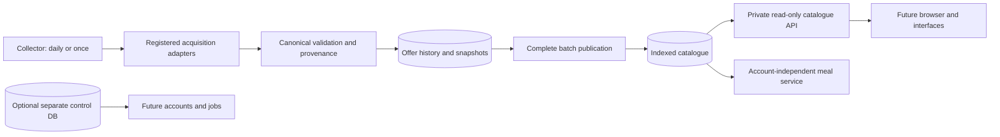

# Collector, catalogue and Docker

The collector is a separate process that uses the existing acquisition adapters and validation
pipeline. It publishes a persisted catalogue from each complete successful source run. Meal
planning and the private HTTP API read saved data; a request never waits for a retailer scrape.
Neither process requires user storage. Browser accounts, jobs, email and SimpleX follow the
recorded [phase order](server-access-plan.md#8-implementation-order-and-acceptance-criteria).



## Collection and configuration

```sh
.venv/bin/grocery-agent collector --once
.venv/bin/grocery-agent collector --config config/collector.toml --once

# Starts the long-running scheduler only when you execute this command:
.venv/bin/grocery-agent collector
```

`config/collector.toml` defaults to source `kupi`, **02:00 Europe/Prague**, with an immediate
startup collection. Kupi's adapter defaults to all 13 food/drink/baby-food categories; remove any
single-listing/category override if you want complete category coverage. Add registered source
IDs to the `sources` list when their coverage and location suit the deployment.
Publication is atomic per acquisition source; a failed source does not replace its old catalogue
and does not prevent attempts for the other configured sources. Ordinary `scrape` also publishes.
Category overrides still produce only that focused collection, not an exhaustive catalogue.

Environment variables override `.env`, which overrides collector TOML defaults:

| Setting | Default |
| --- | --- |
| `GROCERY_COLLECTOR_CONFIG` | `config/collector.toml` |
| `GROCERY_COLLECTOR_SOURCES` | `["kupi"]`, JSON list; native CLI override |
| `GROCERY_COLLECTOR_DAILY_AT` | `02:00`, 24-hour local time |
| `GROCERY_COLLECTOR_TIMEZONE` | `Europe/Prague` |
| `GROCERY_COLLECTOR_RUN_ON_STARTUP` | `true`; additional initial population |
| `GROCERY_CATALOGUE_MAX_AGE_HOURS` | `36`; allowed range 1–168 |
| `GROCERY_CATALOGUE_TIMEZONE` | `Europe/Prague`; inclusive offer validity dates |
| `GROCERY_CATALOGUE_ALLOW_CACHED_ON_FAILURE` | `true` |

There is at most one scheduled round per local calendar day within a collector process. The
first occurrence of autumn's repeated 02:00 is used; spring's nonexistent 02:00 moves to 03:00.
Startup collection is additional; disable it to wait for the next scheduled slot. Restarting
with startup collection enabled can repeat acquisition, but unchanged prices do not create new
history states. Missed slots are not queued. Failed scheduled rounds are logged and wait for the
next daily slot; `collector --once` explicitly retries sooner. Existing incomplete run rows remain
visible after a hard crash. SIGTERM cancellation preserves accepted evidence and marks an active
scheduled acquisition cancelled. No OS timer or service is installed by these files.

## Freshness and expiry

Only a nonempty `success` run can publish. Rejected-item (`partial`), failed, empty, cancelled
and running collections leave the previous head unchanged. Head replacement and cache entries
commit in one transaction. Concurrent readers see a complete old or new catalogue. Each source
has its own head; historical observations and source evidence are retained when derived rows are
replaced. Repeated cards in a batch publish its final observation state once.

After a failed refresh, the last published run is usable only within its configured freshness
deadline. Responses expose the selected run, latest attempt status, deadline, degraded flag and
warnings. Both the batch and the individual observations must be fresh; publication does not
reset item ages. Expired/upcoming offers are hidden using inclusive local dates. By default the
catalogue also excludes unavailable, starting-price and loyalty-only quotes. The API can include
these conditional entries explicitly; each still carries canonical conditions.

Stale data is refused: CLI exits nonzero and the API returns HTTP 503. A fresh catalogue with all
offers expired returns an empty result page. Offer expiry hides active data rather than deleting
history. There is no automatic raw snapshot or historical retention cleanup.

Meal planning additionally applies its own freshness and conditional-price rules. Its default
published reader shows failed-refresh warnings in JSON and HTML. `--strict-latest` selects the
strict history reader and refuses an unsuccessful latest attempt. On an old database with no
published head, planning retains that strict behavior until a successful rescan or rebuild.

## Queries and rebuilding saved runs

```sh
.venv/bin/grocery-agent catalogue kupi --limit 20
.venv/bin/grocery-agent catalogue kupi --search 'kuřecí' --unit kg --sort unit_price
.venv/bin/grocery-agent catalogue kupi --retailer billa --unit kg --max-unit-price 130

# Upgrade/cache a complete saved latest run without a retailer request:
.venv/bin/grocery-agent catalogue kupi --rebuild
# Or explicitly select a known complete batch if the latest attempt failed:
.venv/bin/grocery-agent catalogue kupi --rebuild --run-id UUID
```

Pagination uses `--offset` and `--limit` (maximum 100). Unit-price sorting/filtering requires
`--unit`; prices per kg, litre, piece and package are not compared as interchangeable units.
`--scope`, `--category`, and repeated `--retailer` filter canonical values. Category labels come
from canonical descriptions; a shared category taxonomy is future work. The catalogue groups by
acquisition source, so it does not merge online and leaflet/locality scopes or claim exact
cross-source product equivalence. Decimal price values remain strings in JSON.

## Optional private HTTP app

```sh
.venv/bin/python -m pip install -e '.[catalogue-api]'
.venv/bin/grocery-agent serve-catalogue
```

Default listener: `127.0.0.1:8000`. The app provides:

| Endpoint | Meaning |
| --- | --- |
| `GET /health/live` | Process is alive, even before initial collection |
| `GET /health/ready?source=kupi` | Source has a usable published collection; otherwise 503 |
| `GET /v1/sources` | Source IDs with published heads |
| `GET /v1/status/kupi` | Selected run, latest attempt, freshness and failed-refresh warnings |
| `GET /v1/offers?source=kupi` | Canonical paginated offers |
| `GET /docs` | API reference |

Offer queries support `scope`, `category`, repeated `retailer`, `search`, `unit`, `max_unit_price`,
`sort`, `offset`, `limit`, and explicit `allow_loyalty`, `include_from`, `include_unavailable`.
Filters are validated and there are no write, scrape, account, pantry or report endpoints.
This API is an internal data interface, with no authentication. Keep it private. The browser
release will expose authenticated controls and consume this interface on the server network.

## Docker on the server

Needs Docker Engine, Compose v2, writable Docker storage and retailer internet access. The image
uses Python 3.13, pinned runtime/API dependencies and UID/GID 10001. Browser automation and
Chromium are not included; Tesco needs a separately prepared browser-capable image and verified
access before adding it to a container collection. HTTP adapters work in the supplied image.

```sh
docker compose build

# One collection; these commands do not start the scheduler:
docker compose run --rm cli collector --once
docker compose run --rm cli catalogue kupi --limit 10
docker compose run --rm cli meals --meal-style snack --have chicken=2kg --no-latest

# Explicitly start the persistent collection and read API:
docker compose up -d collector catalogue-api
docker compose logs -f collector
docker compose stop collector catalogue-api
```

The roles share a named `grocery-data` volume and read-only `config/` mount. Image/Compose data
paths are absolute under `/var/lib/grocery-agent`; Python CLI paths remain independently
configurable. A shared filesystem lock prevents overlapping acquisitions. The API uses SQLite
`mode=ro` and query-only transactions; its volume remains writable for SQLite WAL coordination.
It does not migrate or create databases. Initial reads return 503 until collection publishes.

Set collector time/timezone/startup and cache variables in Compose's `.env`; these take precedence
over TOML. Set collection sources in `config/collector.toml`, which is shared with the image;
the Compose file does not forward the native CLI `GROCERY_COLLECTOR_SOURCES` override. The API port
is configurable with `GROCERY_CATALOGUE_PORT`, bound to loopback. The future frontend can reach
`http://catalogue-api:8000` within the Compose network. Public HTTPS, user controls, workers, email
and SimpleX containers are added in their respective later phases.

No control database is initialized by any supplied service. Its future accounts/jobs service must
receive its own volume/database URL. The CLI role uses the `tools` profile and runs commands on
demand. Use separate source/control databases if moving to PostgreSQL; test the target deployment
and migrations before switching. Neither Redis nor an LLM framework is needed for this cache.

Stop all roles and CLI processes before backing up the named volume, including database,
snapshots and reports. Preserve the volume on upgrades; `docker compose down` retains it, while
`down --volumes` removes it. Rebuild the image, run the offer migration with the collector stopped,
then restart. The API never performs upgrades. Remote user access remains phase 3.

The current development machine has no Docker executable, so image/Compose execution has not
been verified locally. CI includes an image build and an offline MockStore/API smoke run. Native
offline tests verify collector publication, expiry, migrations and HTTP responses.
