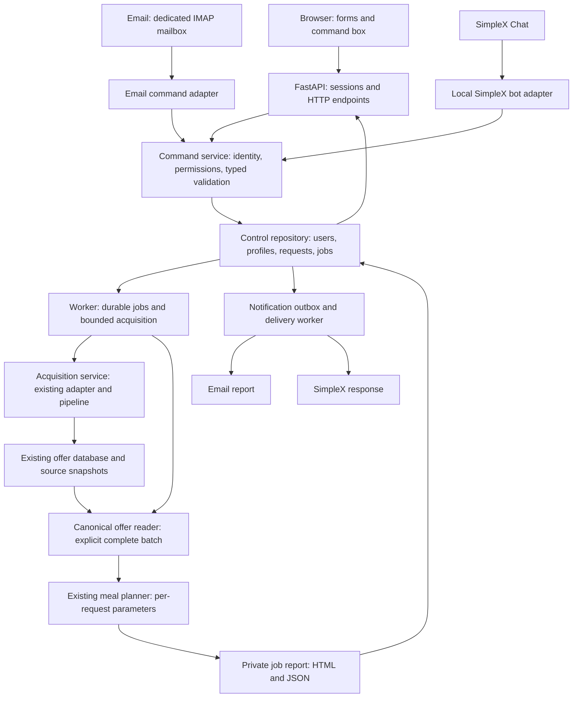

# Server access and command controls

Status: phase 1 foundation and phase 1b meal styles implemented, 2026-10-01. The application
runs through the CLI, independent collector and private read-only catalogue API. Accounts/jobs,
browser controls, email and SimpleX below remain planned. See [implemented services](phase-one.md)
and [collector/catalogue deployment](catalogue.md) for commands available now.

## Confirmed scope

- Support multiple users from the first server release.
- Start with guided browser forms and structured text commands.
- Release browser access first, then configurable email, then SimpleX Chat.
- Allow browser-only, email-only, chat-only and combined operation once those channels exist.
- Use Praha and the existing lactose-free, protein-focused profile as initial defaults; each user
  can save their own supported preferences.
- Keep standalone commands and meal requests on demand, independent of accounts.
- Run acquisition separately through a configurable collector, default 02:00 Europe/Prague.
  Serve the last complete batch after failure only within the freshness limit, showing warnings
  and hiding expired offers. Docker files are prepared; no scheduler was started during implementation.
- Keep main dishes as the default, with optional breakfast and snack styles in phase 1b.

## 1. Architecture



Acquisition still produces canonical domain objects. Channel adapters translate input into common
commands and format results. Retailer-specific interpretation stays inside acquisition adapters.

Extract reusable application services from CLI composition. These services return typed results;
CLI, HTTP, email and chat use them without spawning CLI processes or parsing stdout. Keep global
runtime settings separate from validated user preferences and command overrides.

Proposed interfaces:

```text
CommandService.submit(principal, command, idempotency_key) -> CommandReceipt
CommandService.status(principal, job_id) -> JobView
AcquisitionService.refresh(source_id, acquisition_profile_id, run_id) -> ScrapeResult
MealService.plan(batch, parameters, catalog_snapshot) -> MealReport
```

The service checks permissions regardless of the channel. A command contains a versioned Pydantic
schema and an explicit action. Parameters cannot select arbitrary URLs, server paths, credentials
or shell commands.

Proposed packages:

```text
src/grocery_agent/
  application/           # services, typed commands, parameters, authorization
  accounts/              # users, sessions, invitations, profiles, channel linking
  jobs/                  # queue, worker, leases, recovery, notification outbox
  web/                   # FastAPI routes, Jinja2 templates, static assets
  channels/
    email/               # inbound parser, IMAP transport, SMTP report delivery
    simplex/             # local bot API client and message adapter
  persistence/control/   # SQLAlchemy control repositories and schema
```

Existing `models`, `stores`, `pipeline`, offer persistence and meal planning retain their domain
responsibilities. Add Alembic migrations and deployment files alongside these packages.

## 2. Parameters and structured commands

Use one `MealParameters` schema for forms, JSON requests and text commands. Resolve inputs in this
order: server defaults, saved user profile, request overrides. Persist the effective parameters,
catalog version, pantry snapshot and batch ID with the job for reproducibility.

| Parameter | First release behavior |
| --- | --- |
| Location | Select a supported canonical scope; initially Praha |
| Meal style | Main dishes by default; optional breakfast/snack with configured limits |
| Servings | Integer, 1 to 20 |
| Minimum protein | Decimal grams per serving; initial default 70 |
| Maximum energy | Positive Decimal kcal per serving; initial default 850 |
| Maximum cost | Positive Decimal Kč of ingredients used per serving; initial default 100 |
| Lactose-free | Apply the existing curated ingredient rules |
| Retailers and loyalty | Select supported retailer IDs and whether eligible loyalty offers may be used |
| Maximum stores | Integer, 1 to 3 |
| Ranking | Protein per Kč or total protein among eligible recipe templates |
| Pantry | Known catalog ingredient, owned mass or explicitly sufficient stock, use-first preference |
| Freshness | Server-bounded maximum age; show observed time and expiry |

Money and quantities cross JSON boundaries as decimal strings. Browser inputs preserve those
strings instead of converting prices through JavaScript floating point. Unknown keys and
unsupported units produce actionable validation errors.

Proposed command examples, using the same parser in the browser, email and chat:

```text
meal city=praha lactose_free=true min_protein_g=70 max_cost_per_serving_czk=80 ranking=protein
offers retailer=tesco unit=kg
status job=<job-id>
profile servings=2 max_stores=1
refresh source=kupi profile=meal-basics
help
```

`profile` explicitly saves preferences; `meal` overrides apply only to that request. `refresh`
requires administrator permission initially. The parser uses an allowlist of actions and keys,
supports quoted values, and rejects duplicate keys or ambiguous input. It never evaluates code.
Requests to update preferences from email also require authenticated command confirmation.

Offer search needs a new generic read service supporting pagination, category, retailer, validity,
loyalty and unit-price sorting. Initial category filters use values from canonical product data;
define a shared category taxonomy before expanding unified navigation across acquisition sources.
Compare prices within a compatible unit and currency, display conditional and unknown values,
and keep lower-bound prices distinguishable from exact quotes.

The current source displays Praha; changing a location label does not change acquisition locality.
Other locations require adapter capability work and fixture verification before they appear in
the UI. Cooking-time limits, additional diets and exclusions require explicit catalog/planner
support. Expose supported capabilities instead of accepting settings that are ignored.

Meal suggestions initially rank the curated recipes. Display nutrition estimates, source
freshness, stock uncertainty and ingredient-use cost. Checkout totals and unrestricted recipe
generation are separate future capabilities. Pantry recommendations do not reserve or consume
owned stock; that needs an explicit inventory workflow later.

## 3. Browser interface and multiple users

Use FastAPI with server-rendered Jinja2 pages and small amounts of JavaScript for job polling.
This fits the existing Python/Pydantic application and avoids a separate frontend build service.
FastAPI provides [template integration](https://fastapi.tiangolo.com/advanced/templates/).

Initial pages:

1. Sign in, accept an invitation, and manage the account.
2. Dashboard showing data age, available scopes, recent personal jobs and acquisition health.
3. Meal form and structured command box, with saved profiles and pantry inputs.
4. Cheap-offer browser with filters, comparable unit prices and promotion conditions.
5. Private meal report with recipe steps, macros, ingredient basket and source links.
6. Settings for preferences, linked channels and notification choices.
7. Administrator view for invitations, source refreshes, coverage, failures and queue health.

Forms need visible labels, keyboard navigation, clear field errors, readable mobile layouts and
status messages accessible to assistive technology. Core forms work without JavaScript; the job
page offers manual refresh when automatic progress polling is unavailable.

Accounts are invite-only initially. Bootstrap an administrator through a local management command,
then create expiring invitations; email is optional for this flow. Use an established Argon2
password hashing library, following the [FastAPI password-hashing guidance](https://fastapi.tiangolo.com/tutorial/security/oauth2-jwt/).
Use revocable database-backed sessions with secure HttpOnly cookies, CSRF protection, login rate
limits and explicit session expiry. Administrator-assisted recovery must invalidate prior sessions.

Users share public grocery observations. Profiles, pantry inputs, requests, reports and channel
bindings belong to individual users. Enforce ownership on every read, mutation, report download
and job-status lookup; UUIDs are identifiers, not access credentials. Ordinary users cannot view
another user's records. Sensitive source evidence and operational details require administrator
permission. Keep account settings access separate from grocery administration.

## 4. Durable jobs and persistence

Long acquisitions run in a dedicated worker. HTTP returns a job receipt immediately; clients can
disconnect and later inspect the result. FastAPI documents the need for separate tooling for
[larger background work](https://fastapi.tiangolo.com/tutorial/background-tasks/#caveat).
Use a SQL-backed queue initially; a broker can be added if measured load requires it.

Job states: `queued`, `running`, `succeeded`, `failed`, `cancelled`. Record phase, timestamps,
heartbeat, attempt count and structured errors. A valid request with no feasible meal has an
explicit result and rejection reasons, distinct from an acquisition or infrastructure failure.

- Keep one acquisition active at a time, using the existing shared lock across worker and CLI.
- Coalesce equivalent refresh requests by source, scope and acquisition profile; each requester
  retains their own receipt and notification settings. Apply per-user quotas and a refresh cooldown.
- Normal meal requests reuse eligible fresh data. A missing or failed latest acquisition produces
  an explicit unavailable state and, where permitted, a refresh action.
- Pin planning to an explicit successful run ID and verify scope, requested category coverage,
  item freshness and catalog compatibility. Never read a changing global latest batch mid-job.
- Claim jobs atomically using leases. Persist the intended acquisition run ID before starting;
  reconcile `scrape_runs` after a crash before deciding whether a retry is safe. Recover interrupted
  runs visibly and preserve their observations and evidence.
- Store immutable report files per job and authorize access through the application. Publish a
  completed report reference only after its files are ready. A shared `latest.html` is unsuitable
  for private server results.
- Commit a terminal job result and its notification outbox entries in one control transaction.
  Notification failures do not change a successful meal result. Deliveries have bounded retries
  and visible status; SMTP acceptance does not prove that a user read or received the message.
- Support cancellation and shutdown without discarding accepted acquisition records. Check current
  account/channel authorization again before executing queued work or sending private results.

Start with two repository boundaries: existing offer storage and a new control database. Initially
use separate SQLite files on local disk, keeping acquisition as the only writer of the offer
database. Enable WAL and use short transactions, a busy timeout and bounded retry for contention.
WAL allows
concurrent reads but still permits only [one SQLite writer at a time](https://www.sqlite.org/wal.html).
Keep both SQLAlchemy repositories portable to PostgreSQL; choose PostgreSQL before introducing
multiple acquisition workers or if load tests show SQLite contention.

| Proposed control table | Purpose |
| --- | --- |
| users | Internal identity, password hash, status and role |
| sessions / invitations | Hashed tokens, expiry, revocation and invitation acceptance |
| user_profiles | Versioned meal parameters and private pantry configuration |
| channel_bindings | User-to-verified-email or user-to-SimpleX-contact link, permissions and revocation |
| channel_challenges | Hashed, expiring one-time linking and command-confirmation tokens, bound to a user and action |
| command_requests | Channel event ID, authenticated user, normalized command, outcome and idempotency key |
| jobs | Validated inputs, selected run ID, lease, lifecycle and immutable result reference |
| job_subscribers | Requesters subscribed to a shared refresh, without sharing personal report access |
| notification_outbox | Destination binding, result, delivery attempts and status |
| channel_cursors | Durable mailbox and chat intake checkpoints |
| audit_events | Account, authorization, command and administrative changes |

The run ID linking control records to offer storage is an application-level reference between
repositories. Reconciliation handles the separate commits. Add a migration baseline that safely
adopts existing databases, then migrate control tables. Make ordinary database opening independent
of schema creation so web readers do not run bootstrap DDL. Test backup/restore with database files,
snapshots, reports and, later, SimpleX identity storage.

## 5. Email integration

Support outbound reports and inbound commands as separate configurable features. Use a dedicated
mailbox supplied by the chosen provider, with SMTP submission and IMAP intake over verified TLS.
Python provides [SMTP](https://docs.python.org/3/library/smtplib.html) and
[IMAP](https://docs.python.org/3.14/library/imaplib.html) clients; run their blocking operations in
a separate integration process or bounded threads. Explicitly supply certificate-verifying SSL
contexts. Provider credentials may require an app password or an OAuth implementation; select and
verify that authentication method before deployment.

Outbound messages include plain-text and escaped HTML summaries, job status, macros, ingredient
cost, acquisition age and source links. Browser links require login. In email-only mode include
enough information to use the result without a browser. Users choose completion/failure messages;
deliver only to their verified, linked addresses.

Inbound processing:

1. Poll a configured folder, initially about once per minute, with a durable UIDVALIDITY/UID cursor.
2. Require a previously verified user binding; a `From` address alone cannot authorize a command.
3. Parse a bounded plain-text command block, ignoring quoted replies, attachments and automatic mail.
4. Issue an expiring one-time confirmation token to the user's stored address, bound to the exact
   parsed command. Only its authenticated confirmation queues work. Allow administrators to pair
   users locally so email-only operation does not depend on the web UI.
5. Deduplicate provider events and consumed tokens transactionally before acknowledging intake.
   Show the job ID and return validation errors to verified users; rate-limit confirmation mail.
6. Reply only to the stored verified address, ignoring arbitrary `Reply-To` destinations. Filter
   delivery notices and automatic replies to prevent loops, and retain intake outcomes for recovery.

Provider authentication results may supplement this flow only after verifying the receiver's
trust boundary. Forged authentication headers are a documented concern in
[RFC 8601](https://www.rfc-editor.org/rfc/rfc8601.html#section-7.1).
Redact command tokens, credentials and sensitive message bodies from logs. Inbox access and report
delivery expose content to the configured email provider, which differs from SimpleX transport.

## 6. SimpleX Chat integration

Run a pinned SimpleX Chat CLI release as a local bot, with a Python bridge speaking its official
JSON WebSocket API. The API has no authentication and its local traffic is unencrypted, so keep it
on loopback on the same machine and outside the public reverse proxy. This follows the official
[bot API and security guidance](https://github.com/simplex-chat/simplex-chat/blob/stable/bots/README.md).

Pair a bot contact to an application user through an expiring one-time code created by the signed-in
user or a local administrator. Store the bot identity plus stable local contact identity, rather
than trusting display names. Unpaired contacts receive only onboarding/help responses.

Map received text to the same structured commands. Return acknowledgement, job ID, status and a
compact completed recipe; include authenticated browser links only when web access is enabled.
Never forward a user's message as a SimpleX CLI control command.
Correlate API responses, deduplicate received message IDs, reconnect with backoff, and reconcile
missed messages against stored chat history after disconnection. Ignore unknown protocol events
while keeping the internal command schema strict. Disable group commands and file intake initially.

Persist and back up the bot's identity databases. Use existing SimpleX relays initially; operating
a private relay is a separate infrastructure choice. Add captured API-event fixtures plus a
manual paired-contact acceptance test against the pinned CLI release.

## 7. Configuration and deployment

Add typed server settings and a separate `config/server.toml` for nonsecret deployment options.
Credentials come from environment variables or a private service environment file, with environment
overrides taking precedence. User profiles live in control storage rather than repository files.

Illustrative future configuration; these keys are not accepted by the current CLI:

```toml
[web]
enabled = true
bind = "127.0.0.1:8000"
public_url = "https://groceries.example.org"
registration = "invite_only"

[jobs]
max_acquisitions = 1
refresh_cooldown_seconds = 900

[email]
inbound_enabled = false
outbound_enabled = false
address = "groceries@example.org"
poll_seconds = 60
folder = "GroceryCommands"

[email.smtp]
host = "smtp.example.org"
port = 465
tls_mode = "implicit"
username_env = "GROCERY_EMAIL_SMTP_USERNAME"
password_env = "GROCERY_EMAIL_SMTP_PASSWORD"

[email.imap]
host = "imap.example.org"
port = 993
username_env = "GROCERY_EMAIL_IMAP_USERNAME"
password_env = "GROCERY_EMAIL_IMAP_PASSWORD"

[simplex]
enabled = false
websocket_url = "ws://127.0.0.1:5225"
```

Validate enabled-channel requirements at startup and require authenticated, account-linked intake.
Browser and email receive/send switches can be independent; enabled inbound email requires a
working confirmation sender. Email-only and
SimpleX-only deployments need no public app HTTP listener. Always provide local administration
for bootstrap, channel linking and recovery.

Deploy on one Linux server initially:

- Python 3.13+ environment and pinned, verified optional server dependencies.
- Separate Docker/Compose roles for collector, catalogue API, later browser/control API, job
  worker and optional email/SimpleX/delivery processes. Keep the price volume and optional control
  volume separate; services consume the catalogue without retail network calls. The current
  [Docker foundation](catalogue.md#docker-on-the-server) supplies collector/API/CLI roles.
  systemd is an alternative process manager for native deployments.
- Public browser access through Caddy HTTPS, forwarding only to the private API. The default Caddy
  setup needs correct DNS and reachable ports 80/443; alternatives depend on the server's network.
  See [automatic HTTPS requirements](https://caddyserver.com/docs/automatic-https).
- Trust forwarded headers only from the configured proxy, following
  [FastAPI HTTPS deployment guidance](https://fastapi.tiangolo.com/deployment/https/).
- Protect service secrets and database/report directories, set explicit allowed hosts and request
  limits, and expose liveness/readiness without user data. Admin diagnostics remain authenticated.
- Record request/job/run/channel IDs, phase times, source coverage, rejection counts, queue age and
  delivery errors in structured logs. Store redacted audit events and define retention for private
  requests, raw snapshots and bot history. Alert delivery is opt-in per administrator settings.
- Back up and restore before upgrades; pin releases and migrate with an explicit rollback procedure.

Serving requests continuously and scheduling daily acquisition are separate settings. This plan
introduces on-demand services; it does not activate a recurring acquisition timer.

## 8. Implementation order and acceptance criteria

| Phase | Deliverable | Acceptance criteria |
| --- | --- | --- |
| 1. Services and migrations — implemented | Typed commands/parameters, reusable acquisition and planning, separate optional control schema, explicit batch selection, independent collector/catalogue and Docker files | Offline regressions pass; original history adopted without row changes; isolated request artifacts; failed refresh serves only fresh complete cache and hides expired offers; Docker execution awaits a Docker host |
| 1b. Meal styles — implemented | Main dishes by default, optional breakfast/snack commands, configured recipe styles and style limits | Shared CLI/text parameters; explicit limits override style defaults; protein/cost/pantry/lactose rules tested independently of acquisition |
| 2. Users and jobs | Invitations, sessions, ownership, durable queue, worker, private report publication | Two users submit concurrently; cross-user access denied; jobs survive API restart; worker crash is reconciled; duplicate intake creates one job; incomplete batches cannot publish; stale cache stays unusable and fresh fallback carries warnings |
| 3. Browser release | Guided forms, offer browser, command box, private reports, admin view, HTTPS deployment files | User can sign in, set parameters and get a meal report; admin can request a refresh; keyboard/mobile flow works; long scrape remains responsive; server backup/restore verified |
| 4. Email release | SMTP outbox, verified account linking, IMAP intake, command confirmations and email-only administration | Email-only and combined modes work; spoofed sender cannot queue work; confirmations are one-time; duplicates, mailbox resets, reply loops and transport outages handled; private replies use stored recipients |
| 5. SimpleX release | Local bot bridge, pairing, structured commands, status and result delivery | Two paired users receive only their own results; unpaired users cannot run jobs; reconnect/missed events recovered; bot control port remains private; disabled-channel mode starts cleanly |

Use offline parser, transport and repository fixtures in normal CI. Add authorization tests,
concurrency/recovery tests and an adapter contract for each command channel. Browser tests use
local fixture data; retailer network access is unnecessary. Provider and SimpleX acceptance tests
are separately marked and use explicitly configured test identities.

Suggested commits follow the phases: `refactor: extract workflow services`,
`feat: add accounts and durable jobs`, `feat: add parameterized browser controls`,
`chore: prepare server deployment`, `feat: add configurable email commands`,
`feat: add SimpleX command bridge`.

## 9. Inputs needed before deployment

- Server OS, access method, domain/DNS and whether the host has a public address or needs a proxy.
- Expected user count and load, the initial administrators, and account recovery policy.
- Which supported location/acquisition profiles to expose; Praha is the current verified scope.
- Email provider, dedicated address, SMTP/IMAP authentication and the desired notifications.
- SimpleX bot profile, selected pinned CLI release and users who will perform pairing tests.
- Data retention, backup destination and acceptable storage budget for source snapshots.

These details do not block preparing phases 1 and 2. Resolve server networking before deploying
phase 3 and provider credentials before enabling the later channel integrations.
